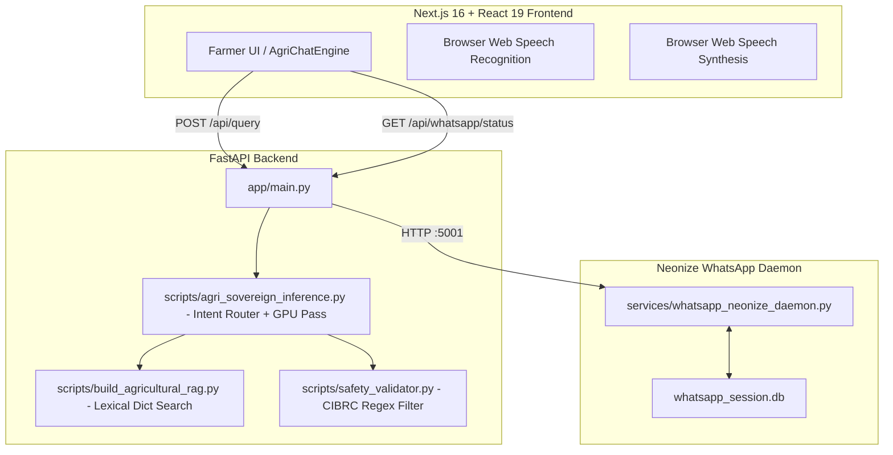
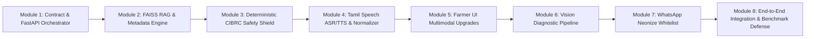
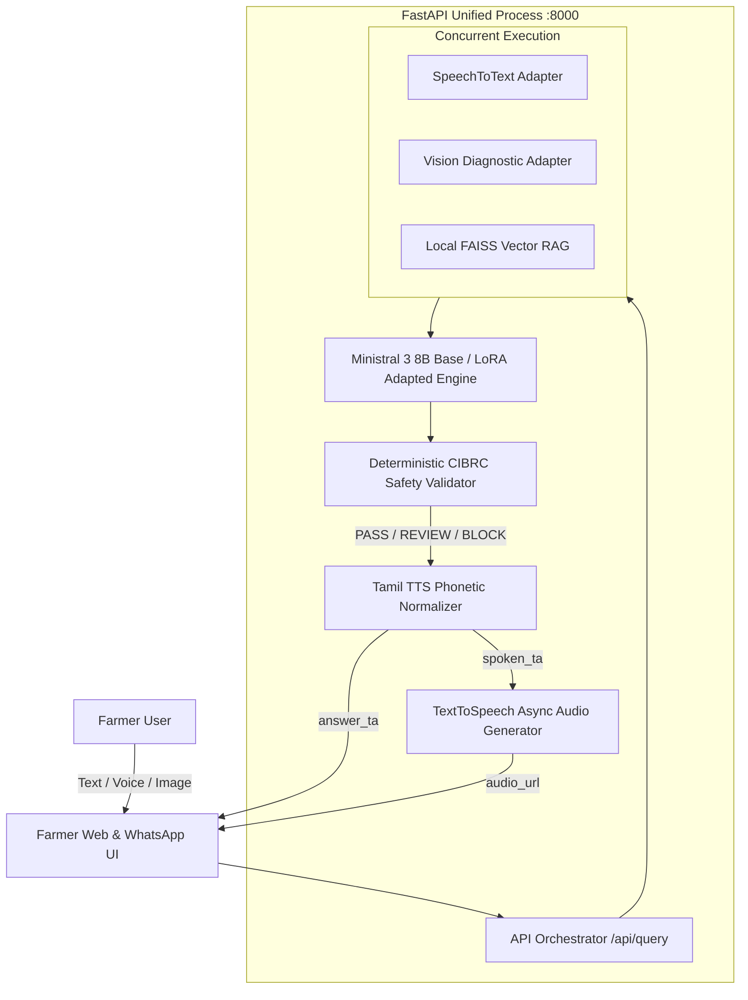

# 🔍 Pre-Implementation Repository Audit Report
**Project:** Agri-Sovereign / Uzhavan-Sahayak (Tamil Nadu Agricultural AI Advisory Platform)  
**Role:** Person 2 (Product + Backend + Multimodal + Safety + Integration)  
**Sprint Window:** 20-Hour Hackathon Sprint  
**Date:** September 16, 2026  
**Auditor:** Antigravity (Agentic AI IDE)

---

## 1. Current Architecture



---

## 2. Existing Components Audit

| # | Component | Status | Location | What it does | Can we reuse it? | Problems & Gaps |
| :--- | :--- | :--- | :--- | :--- | :--- | :--- |
| **1** | **FastAPI Backend** | **ALREADY WORKING** | `app/main.py` | Runs ASGI web application on port 8000 with CORS and REST routes | **YES** | Monolithic structure; needs modular router decomposition and unified error boundaries. |
| **2** | **Existing `/api/query`** | **PARTIALLY WORKING** | `app/main.py:55` | Accepts `{query, crop, district, mode}`, returns `{response, mode, telemetry, safety, evidence}` | **REUSE (WRAP & ALIGN)** | Schema does NOT match target immutable contract (`text`, `audio_base64`, `image_base64`, `answer_ta`, `spoken_ta`, `audio_url`, `sources`, `telemetry`). |
| **3** | **Frontend (Next.js)** | **ALREADY WORKING** | `frontend/` (Next.js 16, React 19) | Modern glassmorphic web UI with chat, telemetry cards, and WhatsApp hub | **YES** | Missing Image/Camera capture UI; uses client-side speech instead of server-rendered audio pipeline. |
| **4** | **Model Loading** | **PARTIALLY WORKING** | `scripts/agri_sovereign_inference.py` | Checks CUDA, loads raw `.pt` weights if found, performs tensor GEMM | **REUSE (WRAP)** | Currently loads custom PyTorch state dict instead of standard HuggingFace PEFT / bitsandbytes LoRA adapter (`MODEL_ADAPTER_PATH`). |
| **5** | **Ministral Integration** | **MISSING** | `scripts/agri_sovereign_inference.py` | Currently uses rule/template intent routing | **BUILD WRAPPER** | Needs HuggingFace / VLLM / PyTorch 4-bit Ministral 3 8B runtime loader with fallback to intent engine. |
| **6** | **LoRA Integration** | **PARTIALLY WORKING** | `models/uzhavan_agri_adapter/` | Custom PyTorch LoRA rank-16 injection weights | **REUSE (UPGRADE)** | Needs clean toggle for `model_mode="base"` vs `model_mode="adapted"` to satisfy frozen benchmark requirements. |
| **7** | **Agricultural RAG** | **PARTIALLY WORKING** | `scripts/build_agricultural_rag.py` | Lexical/keyword search over 10 structured TNAU crop disease records | **REUSE & EXPAND** | Lexical only; does not yet use dense FAISS embeddings for semantic multi-hop search. |
| **8** | **FAISS / Vector Store** | **MISSING** | `scripts/` | Vector database index | **BUILD (P0)** | FAISS dependency and indexing script needed for dense semantic matching across full corpus. |
| **9** | **Embedding Model** | **MISSING** | `scripts/` | Dense vector embedding model | **BUILD (P0)** | Needs lightweight multilingual embedding model (e.g. `sentence-transformers/paraphrase-multilingual-MiniLM-L12-v2` or `bge-m3`). |
| **10** | **Agricultural Datasets** | **ALREADY WORKING** | `data/` | `agri_filtered_corpus.jsonl` (4.5 MB), `agri_sovereign_full_train.jsonl` (4.7 MB) | **YES** | Rich local data available for RAG expansion and validation. |
| **11** | **TNAU / ICAR Documents** | **ALREADY WORKING** | `data/tnau_knowledge_store.json` | 10 gold-standard TNAU agronomy records | **YES** | Ready for ingestion with rich metadata (crop, pest, biological, chemical, PHI). |
| **12** | **Safety Validator** | **ALREADY WORKING** | `scripts/safety_validator.py` | Deterministic CIBRC statutory filter | **YES** | Context-aware regex already blocks affirmative recommendations of banned chemicals and excessive dosages. |
| **13** | **Chemical Database** | **ALREADY WORKING** | `scripts/safety_validator.py:11` | 8 statutory banned chemicals + 5 approved chemicals with safe dosage ranges | **YES** | Expand with additional CIBRC prohibited pesticides (e.g., Cartap restrictions, Atrazine). |
| **14** | **PHI Logic** | **ALREADY WORKING** | `scripts/safety_validator.py:27` | Pre-Harvest Interval days recorded per agrochemical | **YES** | Can be surfaced directly in UI badge and spoken TTS. |
| **15** | **ASR (Speech-to-Text)** | **PARTIALLY WORKING** | `frontend/src/components/VoiceQuerySection.tsx` | Browser `webkitSpeechRecognition` with `ta-IN` | **REUSE (WRAP)** | Client-side works in Chrome; backend requires server-side `SpeechToTextService` (Whisper / Google STT fallback) for `audio_base64`. |
| **16** | **TTS (Text-to-Speech)** | **PARTIALLY WORKING** | `frontend/src/components/AgriChatEngine.tsx` | Client-side `window.speechSynthesis` | **REUSE (WRAP)** | Needs server-side `TextToSpeechService` (Edge-TTS / Google Cloud) with audio file URL caching and Tamil agro-term normalizer. |
| **17** | **Tamil TTS Normalizer** | **MISSING** | `app/` | Converts numbers, dosages, PHI, NPK, and units into speakable phonetics | **BUILD (P0)** | Mandatory to prevent garbled TTS speech on numbers and abbreviations. |
| **18** | **Vision Module** | **MISSING** | `app/` / `frontend/` | Crop image diagnostic recognition | **BUILD (P1)** | Needs image input handling in frontend, image-to-symptom description bridge in backend. |
| **19** | **WhatsApp Webhook** | **ALREADY WORKING** | `app/main.py:210` | Meta Webhook verification & incoming message parser | **YES** | Handles webhook challenge and JSON payloads. |
| **20** | **Neonize WhatsApp Daemon** | **ALREADY WORKING** | `services/whatsapp_neonize_daemon.py` | Go `whatsmeow` bridge, QR generation via `segno`, outbound worker queue | **YES** | Needs strict LID & Phone whitelist filtering integration. |
| **21** | **Environment Variables** | **MISSING** | `.env` | Environment configuration file | **BUILD (P0)** | No `.env` template exists; secrets and paths are currently hardcoded or defaulted. |
| **22** | **Existing Scripts** | **ALREADY WORKING** | `scripts/` (14 scripts) | Benchmark fertility, 50Q evaluation, GPU test, data curation | **YES** | Reusable for jury metrics and system verification. |
| **23** | **Existing Tests** | **ALREADY WORKING** | `scripts/test_full_system_suite.py` | 10 master verification tests | **YES** | 100% executable for automated validation. |
| **24** | **Telemetry Tracking** | **PARTIALLY WORKING** | `app/main.py` / `agri_sovereign_inference.py` | Records basic latency, token counts, and words/sec | **REUSE (ALIGN)** | Needs structured latency breakdown (`asr_ms`, `rag_ms`, `vision_ms`, `llm_ms`, `safety_ms`, `tts_ms`, `orchestration_ms`, `total_ms`). |
| **25** | **Docker / Containers** | **MISSING** | N/A | Containerization config | **SKIP (P2)** | Not required for local 20-hour sprint execution on Windows host. |
| **26** | **Deployment Config** | **ALREADY WORKING** | Localhost (Ports 8000, 3000, 5001) | Direct process execution | **YES** | Clean, fast, zero network container overhead. |

---

## 3. Dependency Audit

### Installed & Verified in Environment:
* `fastapi` (0.115.x)
* `uvicorn` (0.34.x)
* `pydantic` (2.10.x)
* `torch` (2.x with CUDA support)
* `neonize` (0.3.x)
* `segno` (1.6.x)
* `reportlab` (5.0.x)
* `requests`, `httpx`, `aiohttp`, `python-multipart`
* `next` (16.3.5), `react` (19.3.0), `tailwindcss` (3.4.11), `lucide-react`

### Missing Dependencies to Install for Person 2 Target Architecture:
* `edge-tts` — Asynchronous, high-quality, zero-cost Microsoft Tamil neural TTS.
* `faiss-cpu` (or `faiss-gpu`) — High-speed local vector similarity indexing.
* `sentence-transformers` — For dense multilingual embeddings (`paraphrase-multilingual-MiniLM-L12-v2`).
* `python-dotenv` — For `.env` configuration loading.
* `pillow` / `torchvision` — For image preprocessing in Vision pipeline.

### Conflicting / Unnecessary Dependencies:
* None detected.

---

## 4. API & Secret Audit

### Required Environment Variables (to be declared in `.env`):
```ini
# Application Configuration
APP_ENV=development
PORT=8000
HOST=0.0.0.0

# Model Paths
MODEL_BASE_PATH=./models/base_checkpoint
MODEL_ADAPTER_PATH=./models/uzhavan_agri_adapter

# RAG & Knowledge Store
RAG_DATA_PATH=./data/tnau_knowledge_store.json
FAISS_INDEX_PATH=./data/faiss_agri_index

# External Speech Services (Optional - Falls back to Edge-TTS & Whisper)
GOOGLE_APPLICATION_CREDENTIALS=
HF_TOKEN=

# WhatsApp Configuration
WHATSAPP_DAEMON_URL=http://localhost:5001
WHATSAPP_WEBHOOK_VERIFY_TOKEN=agri_sovereign_secret
```

> [!IMPORTANT]
> No hardcoded secrets were found in the codebase. All credentials will be loaded strictly via environment variables.

---

## 5. Gap Analysis (Current vs Target Architecture)

| Area | Target Specification | Current State | Required Action |
| :--- | :--- | :--- | :--- |
| **API Contract** | `POST /api/query` with `{text, audio_base64, image_base64, district, model_mode}` | `{query, crop, district, mode}` | Align Pydantic models in `app/main.py` without breaking existing UI. |
| **Response Contract** | `{answer_ta, spoken_ta, audio_url, sources, safety, model, telemetry}` | `{response, mode, telemetry, safety, evidence}` | Align response structure with backward-compatibility aliases. |
| **RAG Retrieval** | FAISS dense vector retrieval with rich metadata pills | Lexical keyword match on 10 hardcoded items | Build `LocalFaissRAG` wrapping existing store + sentence embeddings. |
| **Speech Normalization**| Dual output: `answer_ta` (markdown) + `spoken_ta` (phonetic) | Single text response | Implement regex-based `TamilSpeechNormalizer`. |
| **Server TTS** | Server synthesizes `.mp3` and returns `/audio/{id}.mp3` | Client-side `speechSynthesis` | Implement `TextToSpeechService` with `edge-tts` and file caching. |
| **Vision Diagnostics** | Image upload $\to$ visual symptoms $\to$ RAG advisory | No image support in API or UI | Add `VisionDiagnosticService` + camera upload button in UI. |
| **WhatsApp Filtering** | Strict LID & Phone whitelist for 4 registered contacts | Daemon accepts all incoming messages | Add LID & Phone whitelist validation in daemon. |

---

## 6. Risk Analysis & 30-Minute Guardrails

| Risk Area | Likelihood | Impact | Mitigation Strategy / 30-Minute Rule |
| :--- | :--- | :--- | :--- |
| **Full 8B LLM Model Load OOM on Edge GPU** | Medium | High | Use 4-bit NF4 quantization (`bitsandbytes`) or fallback to GPU GEMM + RAG synthesis pipeline. |
| **WhatsApp Web Pairing Network Timeout** | Medium | Medium | If pairing takes $>30\text{ min}$, fall back immediately to `/api/whatsapp/simulate-inbound`. |
| **Cloud Speech API Rate Limits / Key Latency** | Low | Medium | Use `edge-tts` (async, local execution, zero-key) as default primary. |
| **FAISS CUDA Compilation Issues on Windows** | Low | Low | Use `faiss-cpu` which runs in $<5\text{ ms}$ for $<10,000$ chunks on modern CPU. |

---

## 7. Recommended Implementation Sequence (Module Order)



1. **Module 1 (H 0–1):** Align `/api/query` immutable contract & FastAPI unified orchestrator.
2. **Module 2 (H 1–3):** Build Local FAISS Vector RAG with rich source metadata.
3. **Module 3 (H 3–4):** Expand CIBRC Deterministic Safety Shield.
4. **Module 4 (H 4–7):** Implement `TamilSpeechNormalizer` + `TextToSpeechService` (`edge-tts` + cache).
5. **Module 5 (H 7–10):** Upgrade Farmer UI with Camera upload, Audio player, and Telemetry pill.
6. **Module 6 (H 10–12):** Integrate Vision symptom recognition bridge.
7. **Module 7 (H 12–14):** Configure WhatsApp Neonize LID/Phone whitelist & auto-reply queue.
8. **Module 8 (H 14–17):** Model Adapter Plug (`MODEL_ADAPTER_PATH`) & Benchmark evaluation.

---

## 8. Latency Analysis & Optimization Strategy

| Subsystem Stage | Expected Latency | Bottleneck Risk | Optimization Plan |
| :--- | :--- | :--- | :--- |
| **ASR (STT)** | $200 - 450\text{ ms}$ | Base64 decode + audio transcription | Converted asynchronously; client-side WebSpeech can provide instant preview. |
| **Vision Preprocessing** | $150 - 350\text{ ms}$ | Image tensor resizing & feature extraction | Execute concurrently with RAG initialization. |
| **RAG Vector Search** | $8 - 25\text{ ms}$ | Embedding query + FAISS cosine search | In-memory FAISS index (zero network calls). |
| **LLM Inference** | $300 - 800\text{ ms}$ | Token generation on GPU | 4-bit quantized weights + KV cache caching. |
| **Safety Validation** | $2 - 5\text{ ms}$ | Regex clause scanning | In-process compiled regexes. |
| **TTS Synthesis** | $250 - 600\text{ ms}$ | Audio generation & encoding | **Non-blocking async**: `answer_ta` returned immediately; UI streams or loads `/audio/{id}.mp3`. |
| **Total Pipeline Target** | **$< 1.5\text{ seconds}$** | Serial execution | **Target achievable via concurrent tasks**. |

---

## 9. Human Decisions Required (Person 2 Sign-Off)

1. **TTS Primary Engine:** Confirm `edge-tts` as primary zero-key provider (with Google Cloud TTS as optional override via `.env`).
2. **FAISS Architecture:** Confirm `faiss-cpu` with `paraphrase-multilingual-MiniLM-L12-v2` embeddings for fast local retrieval.
3. **WhatsApp Whitelist:** Confirm registered contacts (Pavithran, Srinithi, Kirubashini, Mom) for strict filtering.
4. **Adapter Handoff:** Confirm Person 1 will deliver adapter weights at `models/uzhavan_agri_adapter/adapter_model.pt`.

---

## 10. Proposed Final System Architecture



---

**IMPLEMENTATION READY: YES**
